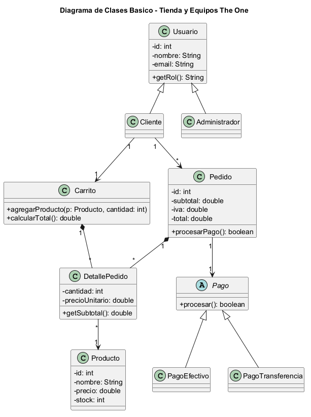
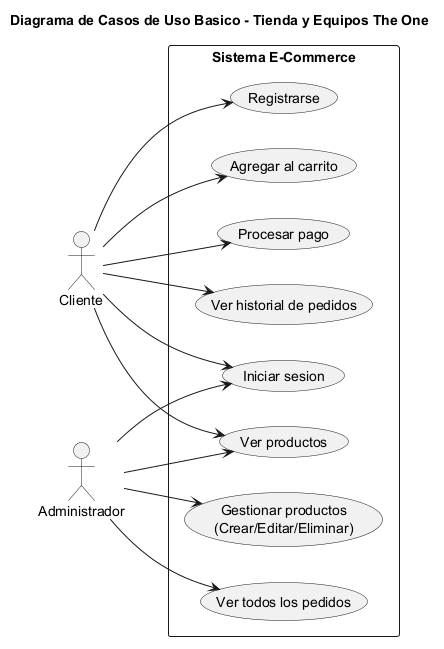

# 🛒 Tienda y Equipos The One

> Proyecto final — Java POO · Programación 2 · 2026
> Fundación Universitaria Tecnológico Comfenalco

## 👥 Integrantes

| Nombre | GitHub |
|--------|--------|
| Gerardo Bru Peralta | - |
| Roberto Muñoz | - |
| Jeremy Castellar | - |

---

## 📋 Descripción

Una plataforma de ecommerce desarrollada en Java con interfaz gráfica Swing que permite a los usuarios comprar computadores y accesorios de computadores. La tienda implementa un sistema completo de carrito de compras con cálculo de IVA colombiano (19%), múltiples métodos de pago sin tarjeta (efectivo y transferencia bancaria), gestión de usuarios con roles diferenciados (cliente y administrador), y persistencia de datos en archivos CSV.

---

## 🚀 Cómo ejecutar

### Requisitos
- Java JDK 24.0.2 o superior
- Apache Ant (para compilación)
- NetBeans (opcional, para desarrollo)

### Pasos
```bash
# 1. Clonar o descargar el proyecto
git clone https://github.com/Antomaker/competencia.git
cd competencia/ecommerce-proyecto

# 2. Compilar el proyecto
ant clean jar

# 3. Ejecutar la aplicación
ant run

# O ejecutar directamente el JAR
java -jar dist/ecommerce.jar

# 4. Acceder con credenciales de prueba
# Admin: admin@email.com (sin contraseña)
# Cliente: juan@email.com o maria@email.com
```

---

## 🏗️ Tecnologías usadas

| Categoría | Tecnología elegida |
|-----------|-------------------|
| Lenguaje | Java 24.0.2 |
| UI / Framework | Swing (JFrame, JTable, JTabbedPane) |
| Persistencia | Archivos CSV |
| IDE | NetBeans |
| Build Tool | Apache Ant |
| Moneda | Pesos Colombianos (COP) |

---

## 🧩 Estructura del proyecto

```
ecommerce-proyecto/
├── src/
│   ├── gui/              # Interfaces gráficas
│   │   ├── LoginWindow.java
│   │   └── MainWindow.java
│   ├── models/           # Modelos de dominio
│   │   ├── Usuario.java
│   │   ├── Cliente.java
│   │   ├── Administrador.java
│   │   ├── Producto.java
│   │   ├── Carrito.java
│   │   ├── DetallePedido.java
│   │   ├── Pedido.java
│   │   └── Pago.java
│   ├── util/             # Métodos de pago
│   │   ├── PagoEfectivo.java
│   │   └── PagoTransferencia.java
│   ├── persistence/      # Gestión de persistencia CSV
│   │   ├── GestorProductosCSV.java
│   │   ├── GestorUsuariosCSV.java
│   │   └── GestorPedidosCSV.java
│   ├── EcommerceFacade.java  # Fachada (Singleton)
│   └── Main.java
├── datos/                # Archivos CSV
│   ├── usuarios.csv
│   ├── productos.csv
│   └── pedidos.csv
├── docs/
│   └── GUIA-ESTUDIANTES.md
├── build.xml             # Configuración Ant
└── README.md
```

---

## 🎯 Funcionalidades implementadas

- [x] Gestión de productos (CRUD - solo admin)
- [x] Gestión de usuarios / clientes (registro y autenticación)
- [x] Carrito de compras
- [x] Cálculo automático de IVA Colombia 19%
- [x] Flujo de pedido y pago sin tarjeta (efectivo y transferencia)
- [x] Historial de pedidos
- [x] Interfaz gráfica Swing funcional
- [x] Persistencia de datos en CSV
- [x] Panel de administración diferenciado
- [x] Validación de stock
- [x] Descuento de stock al procesar pedido

---

## 📐 Conceptos POO aplicados

| Concepto | Clase / método donde se aplica |
|----------|-------------------------------|
| **Herencia** | `Usuario` → `Cliente`, `Administrador` |
| **Encapsulación** | Atributos privados con getters/setters en todas las clases |
| **Polimorfismo** | `Pago` (abstract) → `PagoEfectivo`, `PagoTransferencia` con @Override |
| **Abstracción** | Clase abstracta `Pago` con métodos abstractos `procesar()` y `obtenerDetalles()` |
| **Colecciones** | `ArrayList` en `Carrito`, `Pedido`, gestores CSV para almacenar múltiples objetos |
| **Excepciones** | Manejo con try-catch en validaciones de carrito, pago, autenticación |
| **Singleton** | `EcommerceFacade` como instancia única centralizada |

---

## 📊 Datos principales

- **Moneda**: Pesos Colombianos (COP)
- **IVA**: 19% (aplicado automáticamente en carrito y pedidos)
- **Métodos de pago**: Efectivo (con cambio), Transferencia (con validación de cuenta/banco)
- **Autenticación**: Por correo electrónico, sin contraseña requerida
- **Datos persistentes**: Usuarios, Productos y Pedidos guardados en CSV

### Credenciales de prueba

```
Admin:
  Email: admin@email.com

Clientes:
  juan@email.com
  maria@email.com
  pandi@email.com
```

---

## 🎨 Características de la interfaz

- **LoginWindow**: Interfaz de autenticación limpia por correo
- **MainWindow**: Panel principal con pestañas diferenciadas por rol
  - **Cliente**: Productos | Carrito | Pago | Pedidos
  - **Admin**: Productos | Administración | Pedidos
- **Carrito**: Muestra subtotal, IVA y total automático
- **Pago**: Soporte para efectivo (con cálculo de cambio) y transferencia
- **Administración**: CRUD de productos con validación de stock

---

## 📎 Entregables UML

### Diagrama de Clases


**Fuente PlantUML:** [diagrama-clases.puml](docs/uml/diagrama-clases.puml)

### Diagrama de Casos de Uso


**Fuente PlantUML:** [casos-de-uso.puml](docs/uml/casos-de-uso.puml)
